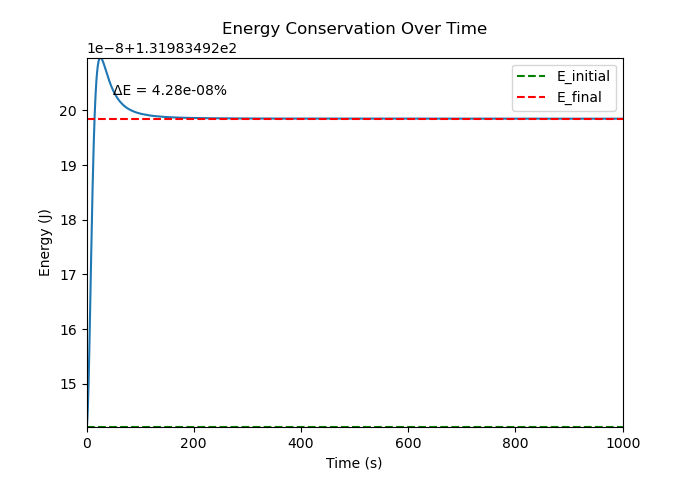
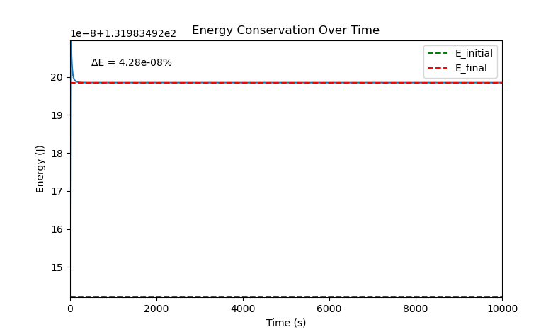
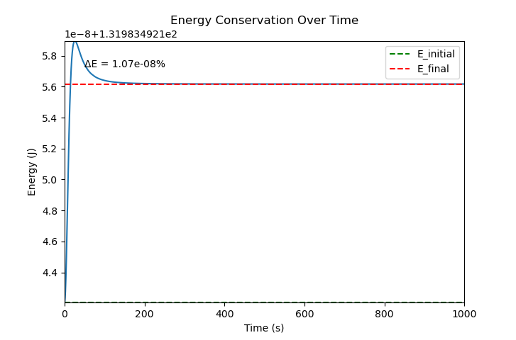

# Validation Results — Velocity Verlet, 3D

This branch documents validation of the 3D Velocity Verlet simulator `v2_verlet_update`.

## 1–2. Energy Conservation — 1,000 vs 10,000 Time Units

**Test:** Total energy close at start vs. end, using Velocity Verlet integration on a symmetric three-body configuration (three equal masses of 10, spaced 100 units apart), over both a shorter and a substantially longer run.

<table>
  <tr>
    <td align="center"> 1,000 time units</td>
    <td align="center"> 10,000 time units</td>
  </tr>
</table>

**Result:** Total energy drift after 1,000 time units was approximately 4.28×10⁻⁸ % roughly 8x better than the equivalent Euler test (3.36×10⁻⁷ %) on the same configuration. Extending the run to 10,000 time units a 10x longer integration window produced essentially the same drift (4.28×10⁻⁸ %), confirming that Verlet's energy error is genuinely bounded over time rather than continuing to accumulate as the simulation runs longer, consistent with its symplectic properties.

---

## 3. Timestep Convergence Check (τ Halved)

**Test:** Verifying that energy error scales as expected with timestep size.

**Result:** Halving the timestep from τ = 0.01 to τ = 0.005 reduced the energy drift from 4.28×10⁻⁸ % to 1.07×10⁻⁸ % — a ~4x improvement, closely matching the theoretical O(τ²) global error scaling expected for Velocity Verlet. This confirms the integrator is implemented correctly, rather than merely producing a coincidentally small result for one specific configuration.

---

## 4. Analytical Validation (Two-Body Circular Orbit)

**Test:** Verifying the energy calculation against a closed-form solution.

**Setup:** Two-body circular orbit with `m1 = [1000]`, `m2 = [10]`, `r = [100]`, using the exact circular-orbit velocity `v = √(Gm1/r)`.

**Result:** Simulated total energy was compared against the analytical solution `E = -Gm1m2/(2r)`. The values matched precisely at t=0, confirming the kinetic and potential energy formulas are implemented correctly. Both the simulated and analytical total energy equaled the same across varying timesteps throughout the run, further confirming both formula correctness and integrator accuracy.

---