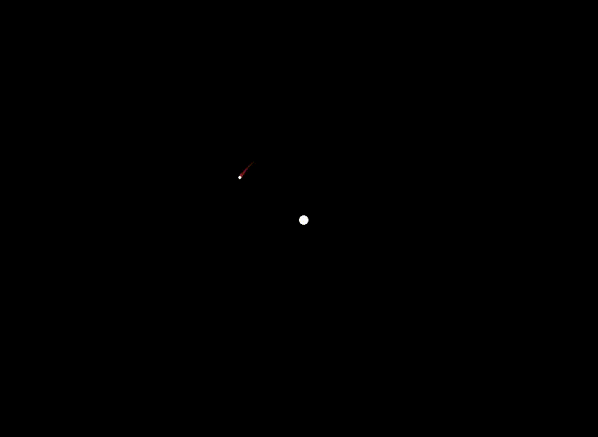
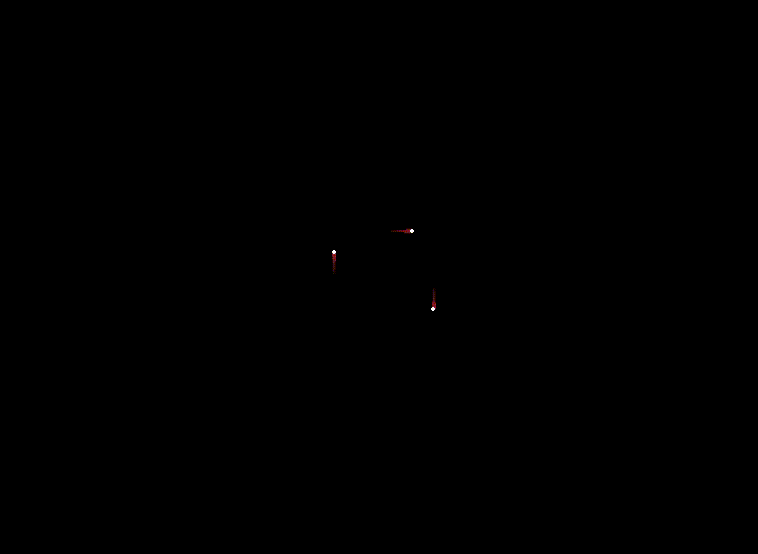
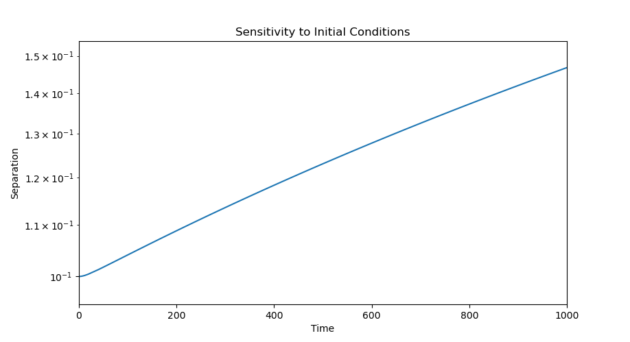
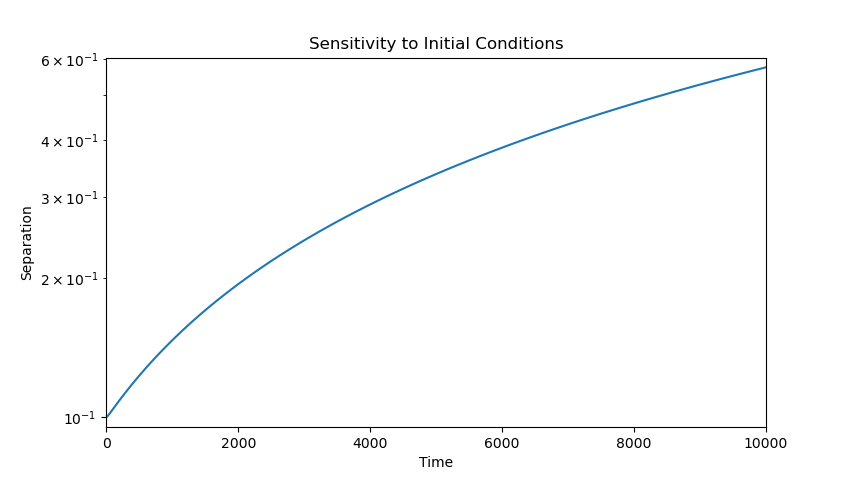
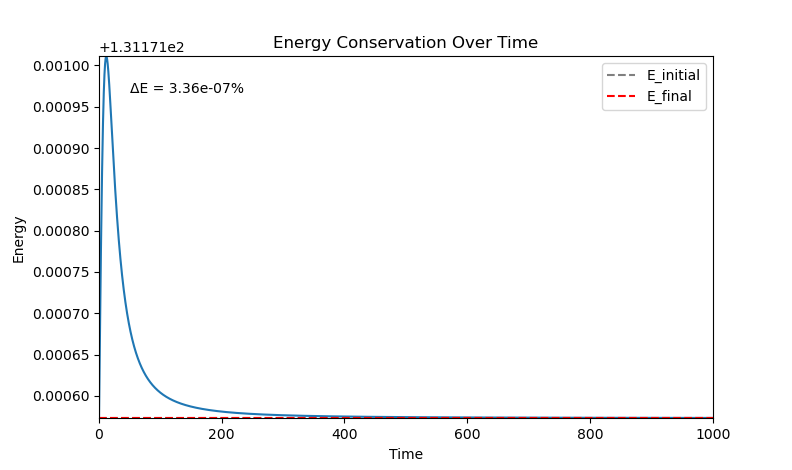
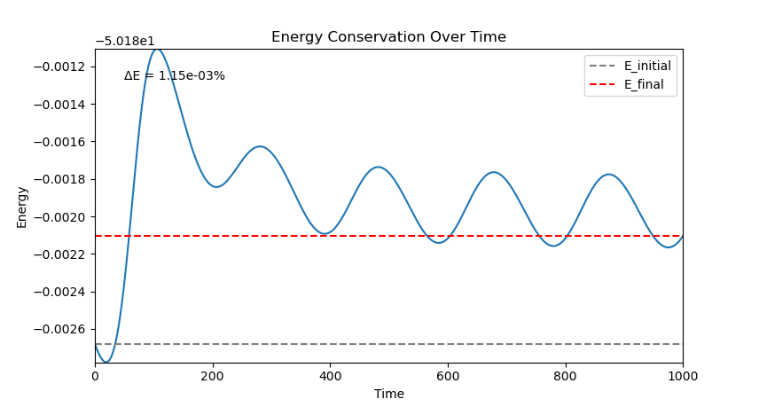

# Validation Results — Euler Integration

This branch documents validation of the `v1_euler_update` simulator.

## 1. Two-Body Circular Orbit
**Test 1:** Confirm the orbit doesn't spiral in or out.

**Result:** We ran a two-body simulation where `mass1 = 1000` remained stationary at the origin, and `mass2 = 10` started at a distance of 100 units away with an initial velocity in the y-direction. Mass2 maintains a stable circular path around mass1 throughout the run, with no visible spiral-in or spiral-out drift.

---

## 2. Three-Body Chaotic Divergence
**Test 2:** Similar-mass bodies show unpredictable motion.

**Result:** As the simulation ran, all three bodies moved along irregular, non-repeating paths — none settled into a stable or periodic orbit, consistent with the expected chaotic behavior of an unstable three-body configuration.

---

## 3. Sensitivity to Initial Conditions
**Test 3:** Two near-identical starts visibly diverge over time.

<table>
  <tr>
    <td align="center"> 1,000 time units</td>
    <td align="center"> 10,000 time units</td>
  </tr>
</table>

**Result:** Two runs identical except for a 0.1 initial position offset in one body shows clear, sustained divergence in separation over time — growing from 0.1 to approximately 0.59 over 10,000 time units. The growth is monotonic but sub-exponential: on a log-scaled y-axis, a straight line would indicate pure exponential (chaotic/Lyapunov-type) divergence, but this curve is concave-down, steepest early on and gradually flattening. This confirms the system is sensitive to initial conditions, though characterizing it as a formal Lyapunov exponent would require further work to isolate true dynamical sensitivity from numerical drift introduced by Euler integration.

---

## 4. Energy Conservation
**Test 4:** Total energy close at start vs. end (some drift expected from Euler).

<table>
  <tr>
    <td align="center"> Symmetric config (equal masses)</td>
    <td align="center"> Eccentric config (mass1=1000, mass2=10, mass3=5)</td>
  </tr>
</table>

**Result:** Two configurations were tested for energy conservation under Euler integration over 1000 time units. The symmetric, equal-mass configuration (three bodies of mass 10, distance 50 apart) showed near-perfect conservation, with total energy dropping from initial to final by approximately 3.36×10⁻⁷ %. The curve shows a sharp early transient — a spike within the first ~20 time units — that quickly settles into a stable plateau for the remainder of the run.

The eccentric, high-mass-ratio configuration (mass1=1000 stationary, mass2=10, mass3=5, at varying distances) showed a much larger relative drift of approximately 1.15×10⁻³ % — roughly 3,400x larger than the symmetric case. Rather than settling to a plateau, this configuration exhibits damped oscillatory behavior, with energy repeatedly swinging away from and back toward the final value as the bodies pass close to one another during their orbits. This is consistent with Euler's per-step error being largest during close encounters, where forces and accelerations change most rapidly.

In conclusion, these results confirm that Euler integration can conserve energy reasonably well over short-to-moderate timescales, but the quality of conservation is strongly dependent on the specific orbital configuration — particularly how eccentric the orbits are and how frequently bodies pass close to one another — rather than being a fixed property of the integrator alone.

---